<h4>Repository for Data Analysis and Visualisation course solutions.</h4>
<h1>Task1</h1>
<h2>Animated bar plots for 5 most populated countries.</h2>
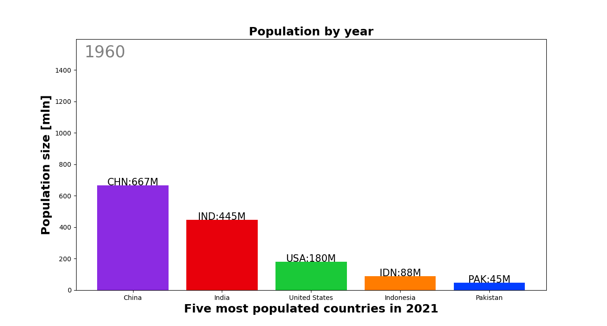
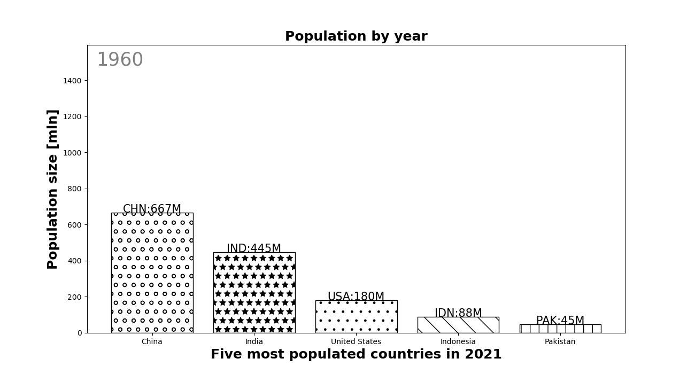
<h2>Animated bar plots for 5 countries with Poland as the centroid.</h2>
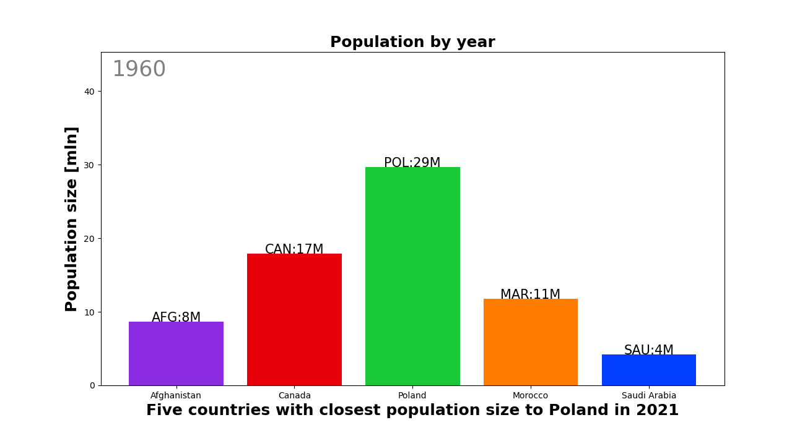
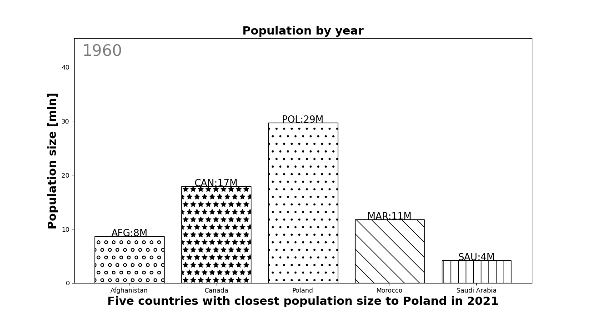
<h2>Animated bar plots for 5 random countries.</h2>
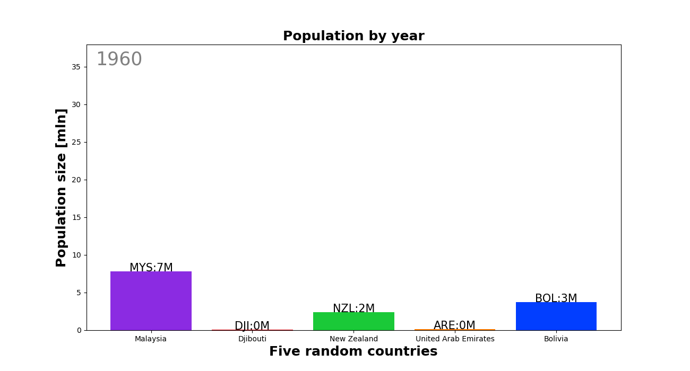
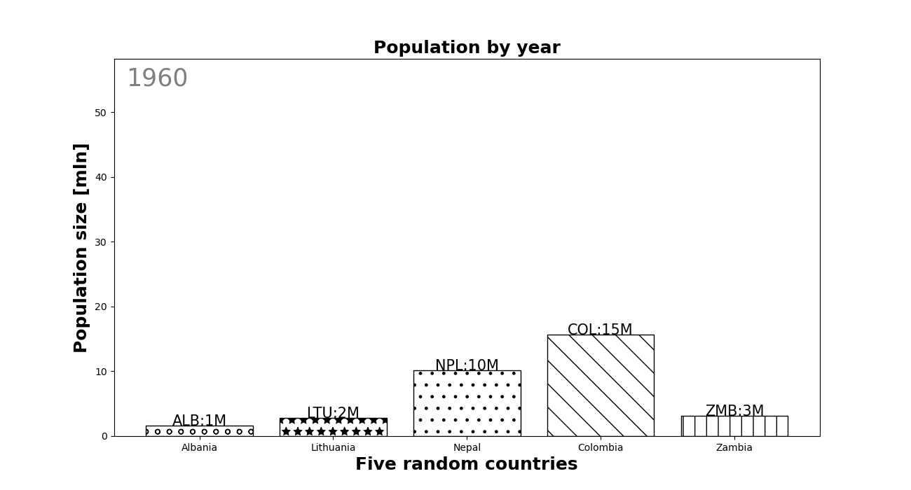

<h1>Task2</h1>
<h2>Animated line plot for 5 most populated countries.</h2>
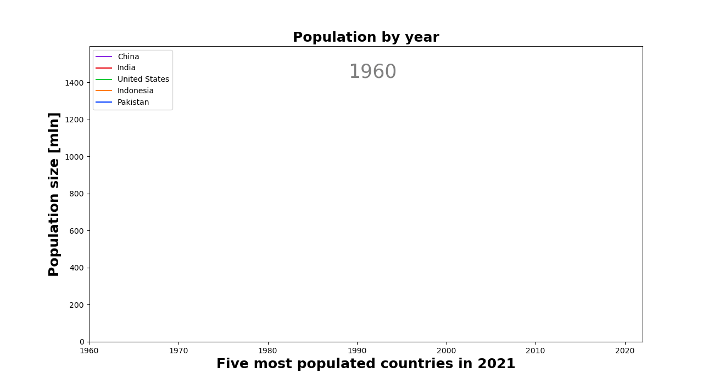
<h2>Animated line plot for 5 countries with Poland as the centroid.</h2>
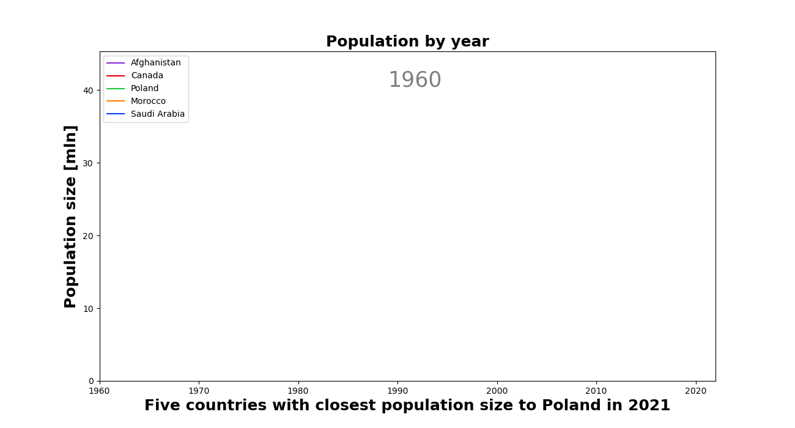
<h2>Animated line plot for 5 random countries.</h2>
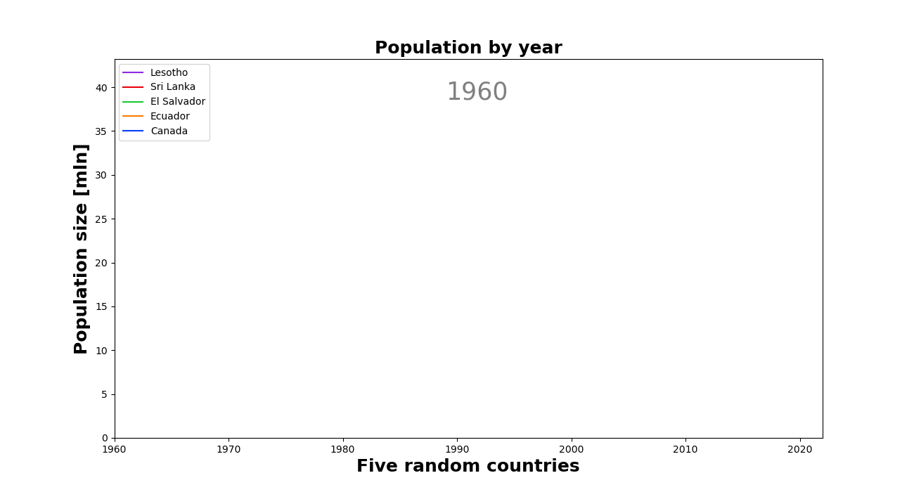

<h1>Task3</h1>
<h2>Bubble plot for 5 most populated countries.</h2>
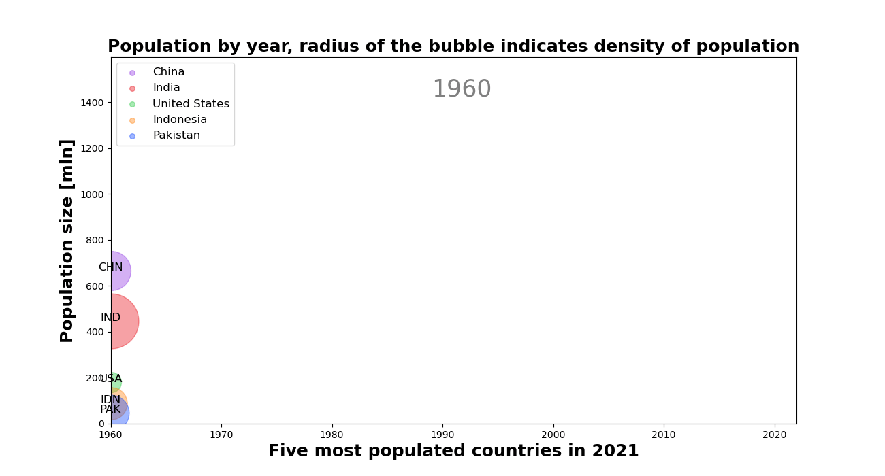

<h2>Bubble plot for 5 random countries.</h2>
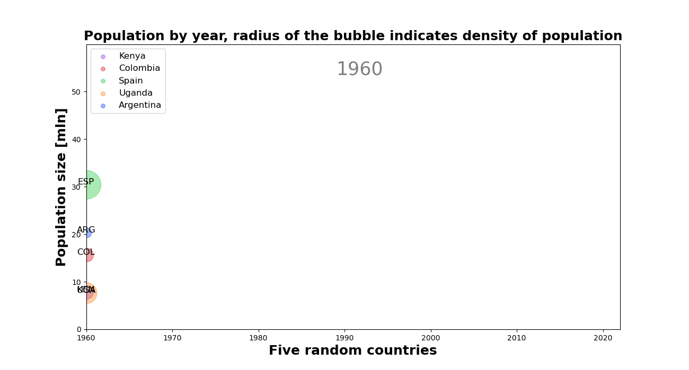

<h2>Bubble plot for 5 countries with Poland as the centroid.</h2>
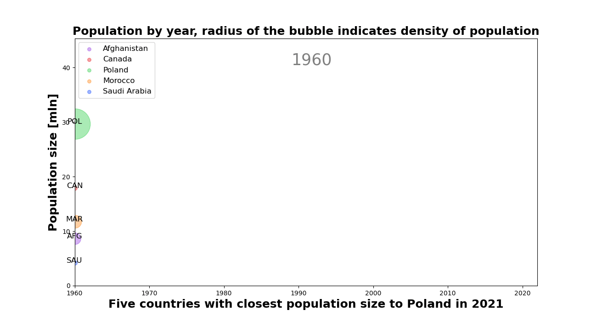

<h2>Pie plot for 5 most populated countries.</h2>
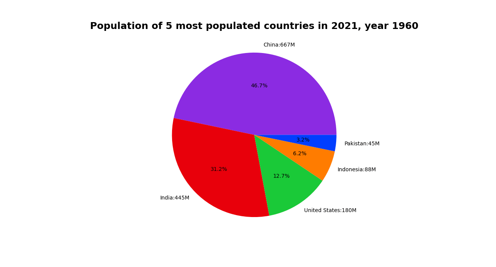

<h2>Pie plot for 5 random countries.</h2>
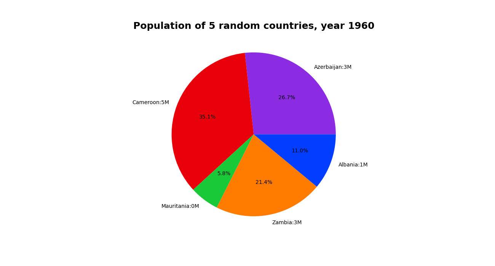

<h2>Pie plot for 5 countries with Poland as the centroid.</h2>
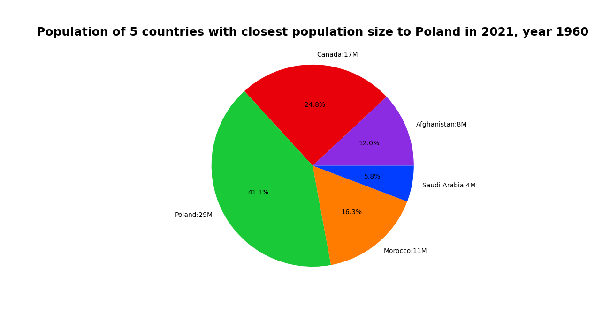

<h2>Bar plot animation with pause.</h2>
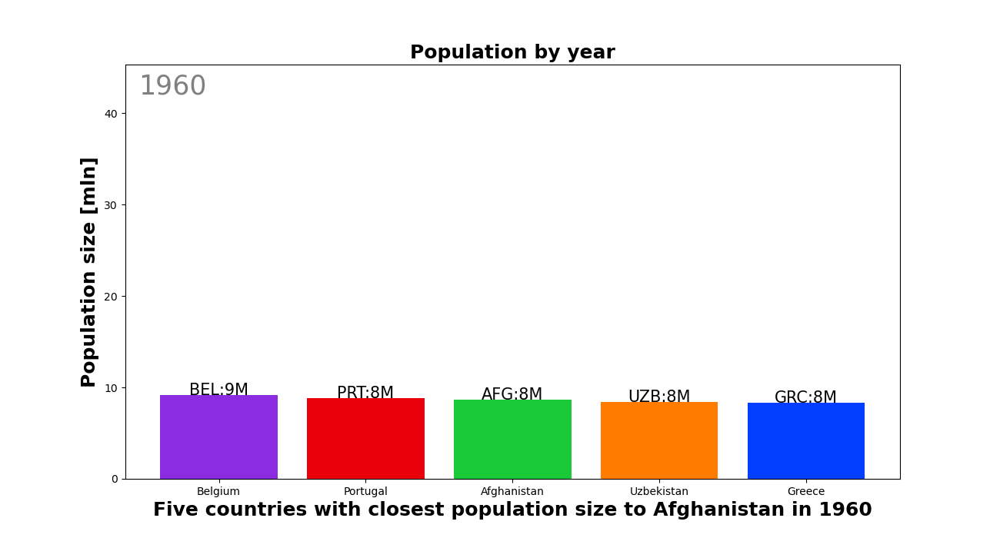

<h2>Gantt plot in color.</h2>
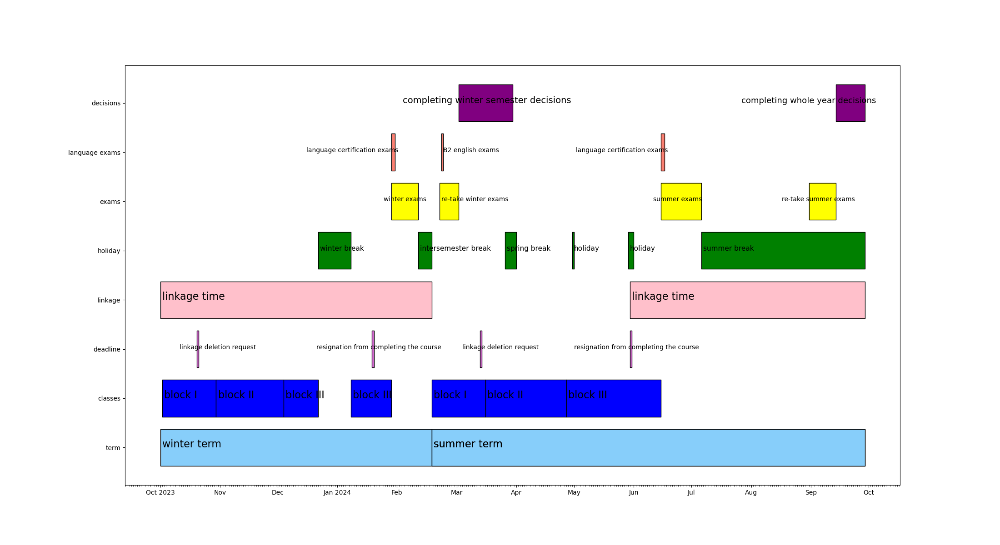

<h2>Gantt plot in black and white.</h2>

